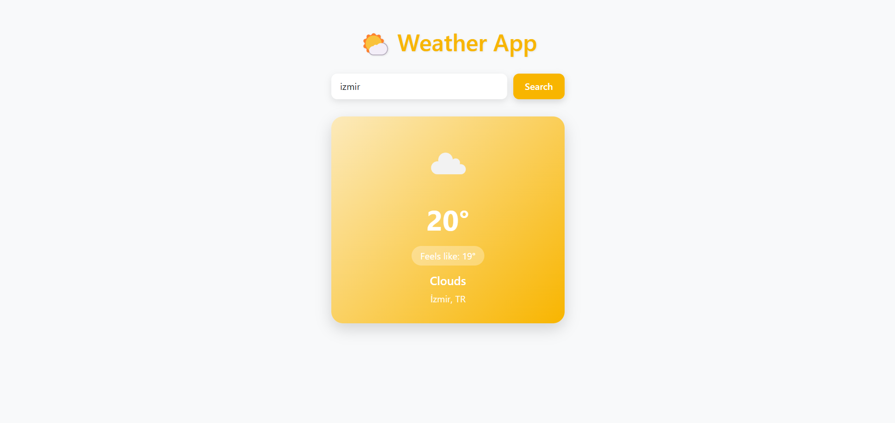

# 🌤️ Weather App

A stylish and simple weather app that fetches real-time weather data using the OpenWeatherMap API. Built with **HTML**, **Bootstrap**, and **JavaScript**, it displays temperature, condition, and other useful weather metrics in a beautiful modern card UI.

---

## 🚀 Features

- 🔍 Search weather by city name
- 🌡️ Shows temperature, "feels like", condition, humidity, and wind speed
- ☀️ Clean and aesthetic weather card UI with gradient styling
- 📱 Fully responsive and mobile-friendly
- 🔄 Weather icons dynamically loaded based on real-time data

---

## 🛠️ Technologies

- HTML5
- CSS3
- Bootstrap 5
- JavaScript (Vanilla)
- OpenWeatherMap API

---

## 📦 Setup Instructions

### 1. Clone the Repo
```bash
git clone https://github.com/Ordnarycoder/Weather-App-50.git
```

### 2. Get an API Key
- Sign up at [OpenWeatherMap](https://openweathermap.org/api)
- Generate a free API key from your dashboard

### 3. Add API Key
Open `script.js` and paste your API key:
```js
const apiKey = "YOUR_API_KEY_HERE";
```

### 4. Run Locally
Just open `index.html` in your browser — no build tools needed!

---

## 🖼️ Screenshots

> 

---

## 📁 File Structure
```
weather-app/
├── index.html        # Main HTML file
├── style.css         # Custom styles
├── script.js         # Weather logic & API fetch
└── README.md         # You're here 😄
```

---

## ✨ Future Improvements

- 5-day forecast
- Dark mode toggle
- Geolocation (detect weather based on user's location)
- Add weather animations

---

## 📄 License

MIT License. Use it, improve it, share it!

---

Made with ❤️ by Eyüp İrfan Çelik